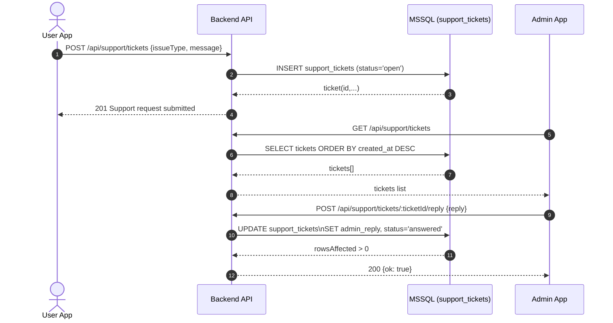

# Gaming Body Backend

Node.js + Express backend for Gaming Body.

Container build, Jenkins pull request pipeline, registry, and Kubernetes
staging setup are documented in [CI_CD_DEPLOYMENT.md](CI_CD_DEPLOYMENT.md).

Runtime secrets are loaded by `settings.js` from Azure Key Vault before the
application imports database, mail, authentication, or provider modules.
Non-empty environment or `.env` values take priority; Key Vault is used only
for settings that are missing locally.

## Deployed Backend URL

`https://gaming-body-backend-s0bz.onrender.com`

Health check:

`https://gaming-body-backend-s0bz.onrender.com/api/health`

## Tech Stack

- Node.js
- Express
- SQL Server / Azure SQL (via `DATABASE_URL`)
- JWT authentication
- Nodemailer

## Local Setup

1. Install dependencies:

```bash
npm install
```

2. Copy env file and update values:

```bash
cp .env.example .env
```

3. Start backend:

```bash
npm run dev
```

Production start:

```bash
npm start
```

Initialize or repair the Azure SQL schema:

```bash
npm run db:init
```

## Environment Variables

Required and commonly used keys:

- `PORT`
- `JWT_SECRET`
- `JWT_EXPIRY`
- `DATABASE_URL`
- `SMTP_HOST`
- `SMTP_PORT`
- `SMTP_SECURE`
- `SMTP_USER`
- `SMTP_PASS`
- `MAIL_FROM`
- `PASSWORD_RESET_TTL_MINUTES`
- `ADMIN_EMAIL`
- `ADMIN_SIGNUP_CODE` or `ADMIN_SIGNUP_CODE_HASH`

Notes:

- Do not commit real secrets.
- In production, prefer `ADMIN_SIGNUP_CODE_HASH` instead of plain `ADMIN_SIGNUP_CODE`.

## API Base Path

All routes are under `/api`.

Main route groups:

- `/api/auth`
- `/api/bets` (protected)
- `/api/wallet` (protected)
- `/api/admin` (admin only)
- `/api/health`

## Deployment (Render)

Typical Render settings:

- Build Command: `npm install`
- Start Command: `npm start`
- Health Check Path: `/api/health`

Ensure all environment variables are set in Render dashboard.


